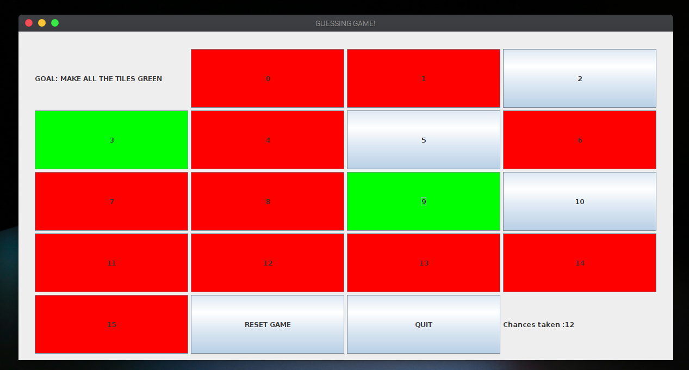
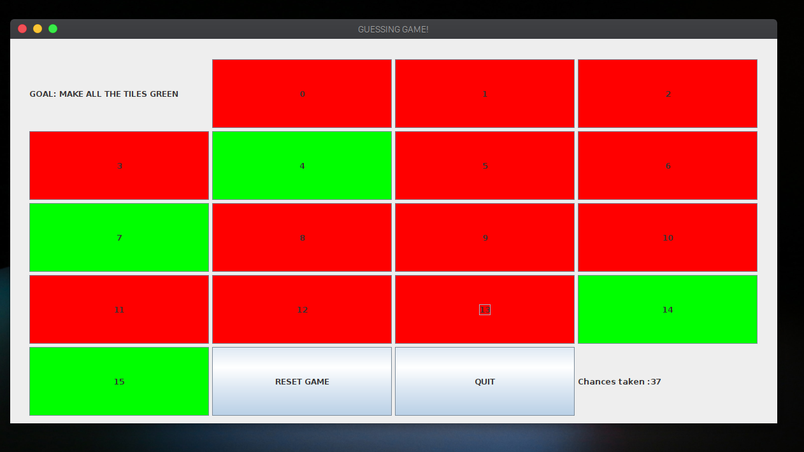

# Java-Fun 

A simple( although in looks!!) Java Guessing game made as part of Assignment but harder to nail it !! (PS: Immediate assignment!!)

## HOW TO PLAY

The task is simple make all tiles shown green.
Everytime the game starts a random no is hidden behind any of the tile.Seaching and hitting it makes it green if wrong it turns red.

## Setting up

    git clone https://github.com/Zaidtech/Cloned-it.git
    
    cd  into the clones dir.
    
### Launch the game

    java <Guessing_game.java>
    
 And you are good to go!!
 Enjoy!! 😆

### Preview

   
   
